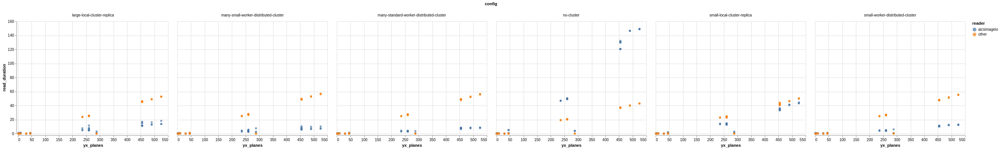

# Benchmarks

The development team behind AICSImageIO care deeply about read time. We personally
understand that it is a pretty common experience of simply trying to load a file into
memory and that read resulting in minutes of waiting if the file is large enough.

These benchmarks are our attempt at ensuring we have comparable or better read times
than the other common microscopy image reading libraries:
* [imageio](https://github.com/imageio/imageio)
* [tifffile](https://github.com/cgohlke/tifffile)
* [czifile](https://pypi.org/project/czifile/)

## Results

_Full image read time (seconds) against number of YX planes in the image._

## Discussion


## Historical Benchmarks
Benchmarks will be ran and published at least every "minor" release.
* To view or download the charted benchmark results, please see:
[benchmarks](https://github.com/AllenCellModeling/aicsimagio/docs/_static/benchmarks)
* To view or download the raw benchmark result data, please see:
[quilt resources](https://open.quiltdata.com/b/aics-modeling-packages-test-resources/packages/aicsimageio/benchmarks/revisions)

## Running the Tests
If you are interested in how we run our benchmarks please see the
[benchmark.py](https://github.com/AllenCellModeling/aicsimageio/scripts/benchmark.py)
and [chart_benchmarks.py](https://github.com/AllenCellModeling/aicsimageio/scripts/chart_benchmarks.py)
files.

Unfortunately, these scripts utilize a
[SLURM cluster](https://slurm.schedmd.com/overview.html) to construct the various Dask
cluster configurations. If you have a different HPC cluster at your organization or
prefer using a cloud deployment and wish to run these tests yourself, please see
[dask_jobqueue](https://jobqueue.dask.org/en/latest/) and
[dask_cloudprovider](https://cloudprovider.dask.org/en/latest/) and swap out the
`SLURMCluster` object for whichever object works best for you. Regardless of underlying
compute, we feel it safe to say the results should be fairly similar to what is
presented in this document.

Full commands to run benchmarks in a fresh environment:
```
conda create --name aicsimageio-benchmark python=3.7 -y
conda activate aicsimageio-benchmark
git clone https://github.com/AllenCellModeling/aicsimageio.git
cd aicsimageio
pip install --no-cache-dir -e .[benchmark]
python scripts/benchmark.py
```
