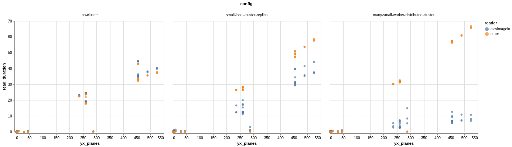

# Benchmarks

The development team behind AICSImageIO care deeply about read time. We personally
understand that it is a pretty common experience of simply trying to load a file into
memory and that read resulting in minutes of waiting if the file is large enough.

These benchmarks are our attempt at ensuring we have comparable or better read times
than the other common microscopy image reading libraries:
* [imageio](https://github.com/imageio/imageio)
* [tifffile](https://github.com/cgohlke/tifffile)
* [czifile](https://pypi.org/project/czifile/)

## Results

_Full image read time (seconds) against number of YX planes in the image._
_(Lower is better)_
_aicsimageio.imread read times in blue and_
_imageio.imread, czifile.imread, or tifffile.imread read times in orange_

### Configs
* `no-cluster`: single-threaded, no `distributed.Client` connection available
* `small-local-cluster-replica`: simulates a `distributed.LocalCluster` on common
  workstations at AICS. Four (4) Dask workers, each with two (2) cores available.
* `many-small-worker-distributed-cluster`: simulates the normal cluster setup that is
  preferred for large workloads. 128 Dask workers, each with one (1) core available.

## Discussion
In single-threaded full-image read performance aicsimageio is at least comparable to
the underlying core libraries. There is overhead from the metadata and dimension
management, but that overhead is typically negligible compared to the raw data read
times. By parallelizing with an underlying Dask implementation we are able to achieve
gains that clearly increase performance in the distributed case. The more workers you
provide to the cluster, the better it gets. With 128 workers reading ~500 YX plane
files (~400MB) we see read times of about 10 seconds.

To gain concurrent read benefits from `aicsimageio` is as easy as:
```
from aicsimageio import imread, dask_utils

with dask_utils.cluster_and_client() as (cluster, client):
   img = imread("my_file.tiff")
```

**Note:** There are two different ways for `aicsimageio` to load imaging data from a
file, either delayed or immediately in memory. Internally, `aicsimageio` determines how
to load the image data based off of which function you ran and if there is a
`distributed.Client` available in the current Python process. The only situation in
which imaging data will be read in a non-delayed fashion is when using `AICSImage.data`
or `Reader.data` while also not having a `distributed.Client` available in the current
Python process. This means that for all other situations and functions,
(`AICSImage.dask_data`, `AICSImage.get_image_data`, `AICSImage.get_image_dask_data`,
etc.), the imaging data is retrieved in a delayed fashion. We do this to optimize read
performance for the majority of situations we encounter as well as additionally
supporting file reading of any size imaging file. The benefits of this strategy can be
seen by our benchmark results above.

## Historical Benchmarks
Benchmarks will be ran and published at least every "minor" release.
* To view or download the charted benchmark results, please see:
[benchmarks](https://github.com/AllenCellModeling/aicsimagio/docs/_static/benchmarks)
* To view or download the raw benchmark result data, please see:
[quilt resources](https://open.quiltdata.com/b/aics-modeling-packages-test-resources/packages/aicsimageio/benchmarks/revisions)

## Running the Tests
If you are interested in how we run our benchmarks please see the
[benchmark.py](https://github.com/AllenCellModeling/aicsimageio/scripts/benchmark.py)
and [chart_benchmarks.py](https://github.com/AllenCellModeling/aicsimageio/scripts/chart_benchmarks.py)
files.

Unfortunately, these scripts utilize a
[SLURM cluster](https://slurm.schedmd.com/overview.html) to construct the various Dask
cluster configurations. If you have a different HPC cluster at your organization or
prefer using a cloud deployment and wish to run these tests yourself, please see
[dask_jobqueue](https://jobqueue.dask.org/en/latest/) and
[dask_cloudprovider](https://cloudprovider.dask.org/en/latest/) and swap out the
`SLURMCluster` object for whichever object works best for you. Regardless of underlying
compute, we feel it safe to say the results should be fairly similar to what is
presented in this document.

Full commands to run benchmarks in a fresh environment:
```
conda create --name aicsimageio-benchmark python=3.7 -y
conda activate aicsimageio-benchmark
git clone https://github.com/AllenCellModeling/aicsimageio.git
cd aicsimageio
pip install --no-cache-dir -e .[benchmark]
python scripts/download_test_resources.py --top-hash 5e665ed66c1b373a84002227044c7a12a2ecc506b84a730442a5ed798428e26a
python scripts/benchmark.py
```
